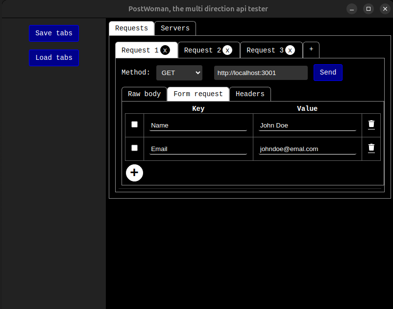

# Electron PostWoman

Electron PostWoman is a cross-platform desktop application for API testing, similar to Postman. However, it offers a unique two-way functionality:  
- **Client Mode:** Send requests (GET, POST, DELETE, etc.) to test your APIs.  
- **Server Mode:** Spin up multiple mock servers to receive and inspect incoming requests, including headers and body content.

The application is designed for developers who need an all-in-one API testing solution that supports both request sending and server-side debugging.

## Features  

### ✅ Current Capabilities  
- Multiple request tabs  
- Support for raw body and HTML form body requests  
- Custom request headers  
- Persistent tab management (save/load current tabs)  
- Multiple server instances running on different ports simultaneously  
- Response headers inspection for mock servers  
- Optional raw body response for server requests  

### 🚀 Upcoming Features  

#### **Request Enhancements**  
- Save/load request history  
- Save/load request collections  
- Authentication & Authorization (e.g., Bearer Token support)  
- Pre-request scripts  
- Cookie Manager  
- Render response as HTML
- Render response as Json and prettify

#### **Server Enhancements**  
- Predefined response routing  
- Authentication & Authorization  

#### **General Improvements**  
- Logging client and server requests to a file  

## Technology Stack  

Electron PostWoman is built using:  
- **Electron** – for cross-platform desktop application development  
- **Node.js** – backend runtime environment  
- **React.js** – frontend framework  

The application supports **Windows, macOS, and Linux**. While it has not been tested on Raspberry Pi, it may also be compatible.

## NodeJS version:
- node/22.14.0

## Current Status  

The project is in **beta testing**. Contributions, feedback, and issue reports are welcome!  

---
🔧 **Contributions & Feedback**: If you'd like to contribute, report issues, or suggest new features, feel free to submit a pull request or open an issue.  